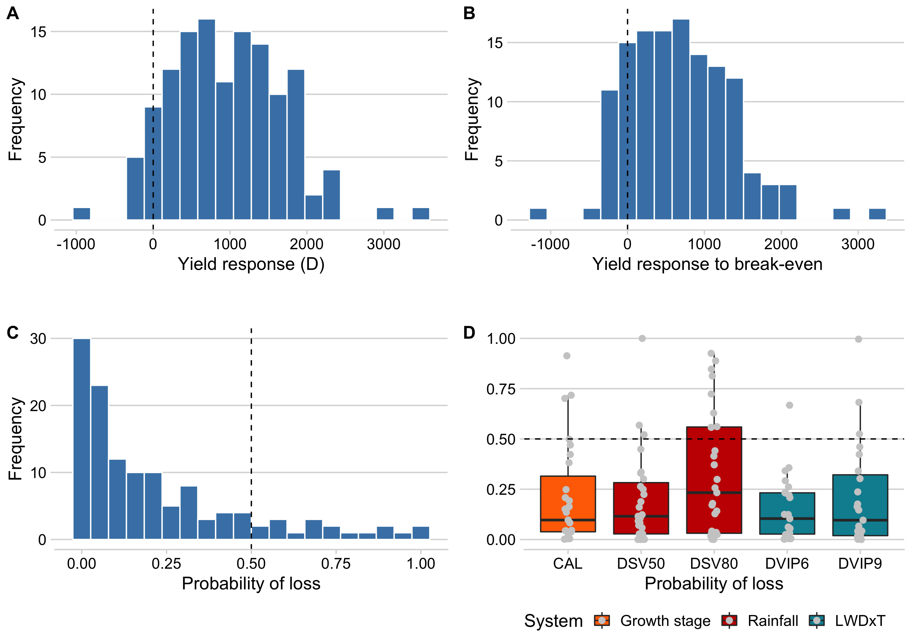

% Introduction

 This website provides an interface for visualizing the fully documented R codes used to analyse data for the study "Performance and Profitability of Rain-Based Thresholds for Timing Fungicide Applications in Soybean Rust Control". 

The goal of this research was to develop and evaluate a simple DWS in Brazil based on summaries of daily rainfall for recommending fungicide sprays against soybean rust. The new warning system was compared with another system based on leaf wetness duration-temperature model and a standard calendar spray program with regard to performance and profitability under tropical weather conditions of Brazil. The disease severity and yield data were otabined from 29 experiments conducted at six sites across four States in Brazil during the 2012-13, 2014-15 and 2015-16 growing seasons, which represented different growing regions and climatic conditions. 

